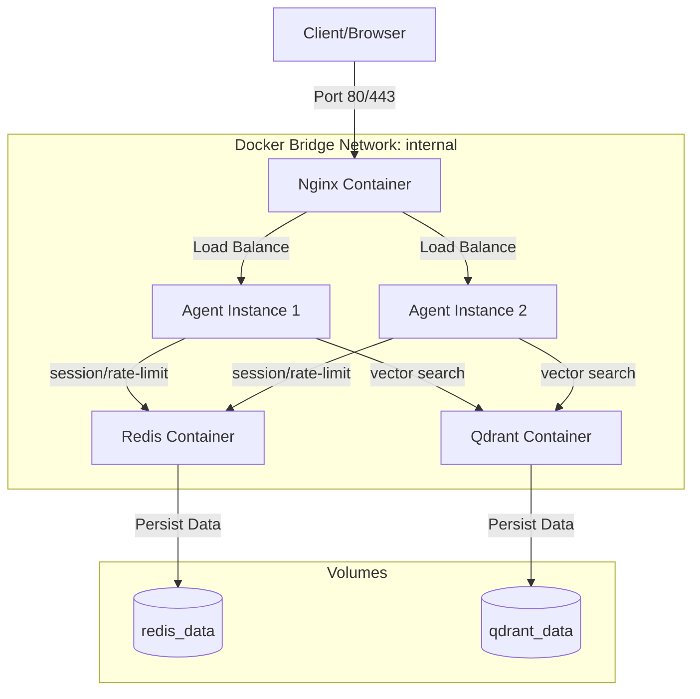

# Day 12 Lab - Mission Answers

## Part 1: Localhost vs Production

### Exercise 1.1: Anti-patterns found in develop/app.py
1. **Hardcoded API Key & Database URL (Dòng 17-18):** Mã khóa bí mật (`sk-...`) và thông tin kết nối cơ sở dữ liệu (`postgresql://...`) bị nhúng cứng trong mã nguồn. Nếu đẩy code lên GitHub, các khóa này sẽ bị lộ ngay lập tức.
2. **Thiếu quản lý cấu hình (Config Management) (Dòng 20-22):** Các cài đặt cấu hình như `DEBUG = True` và `MAX_TOKENS = 500` bị viết cứng dưới dạng biến toàn cục thay vì được cấu hình linh hoạt qua biến môi trường.
3. **Sử dụng print thay vì logging chuyên nghiệp (Dòng 32-34):** Việc sử dụng lệnh `print` làm cho log không có cấu trúc, thiếu log levels (INFO, WARN, ERROR), thiếu timestamp, và đặc biệt nguy hiểm khi vô tình in cả `OPENAI_API_KEY` ra log console.
4. **Không có Health Check endpoint (Dòng 42):** Ứng dụng không cung cấp endpoint kiểm tra trạng thái hoạt động. Khi chạy trên cloud, nếu ứng dụng bị treo hoặc crash, cloud platform không có cách nào phát hiện để tự động khởi động lại.
5. **Cố định host và port (Dòng 51-53):** Gán cứng `host="localhost"` (chỉ chấp nhận kết nối nội bộ từ máy chạy app, không nhận kết nối từ ngoài container) và `port=8000` (cloud platform gán cổng động qua biến môi trường `PORT`), đồng thời bật `reload=True` trên môi trường production làm giảm hiệu năng hệ thống.

---

### Exercise 1.3: Comparison table

| Feature | Develop / Basic | Production / Advanced | Tại sao quan trọng? |
|---------|---------|------------|----------------|
| **Config**  | Viết cứng (Hardcode) trong code. | Đọc động từ Environment Variables (thông qua `config.py` sử dụng `pydantic-settings`). | Giúp bảo mật thông tin nhạy cảm (secrets) và dễ cấu hình ứng dụng linh hoạt trên nhiều môi trường (dev, staging, prod) mà không cần thay đổi source code. |
| **Health check** | Không có. | Cung cấp endpoints `/health` (Liveness) và `/ready` (Readiness). | Giúp Cloud Platform kiểm tra sức khỏe của ứng dụng. Nếu `/health` trả về lỗi, container sẽ tự động được restart. Nếu `/ready` trả về lỗi (do đang khởi động/mất kết nối DB), load balancer sẽ ngừng chuyển traffic tới. |
| **Logging** | Dùng `print()` thô sơ và không có cấu trúc. | Định dạng JSON structured logging, có phân cấp log level (`INFO`, `DEBUG`). | Giúp các hệ thống thu thập log tập trung (như Datadog, ELK, Grafana Loki) dễ dàng parse dữ liệu, tìm kiếm lỗi nhanh chóng và giám sát các chỉ số hoạt động. |
| **Shutdown** | Đột ngột ngắt tiến trình (Hard kill). | Bắt tín hiệu `SIGTERM` để thực hiện Graceful Shutdown thông qua lifespan của FastAPI. | Đảm bảo các request đang chạy (in-flight) được xử lý hoàn tất, đồng thời đóng an toàn các kết nối đến DB/Redis trước khi tiến trình tắt hoàn toàn. |

---

## Part 2: Docker

### Exercise 2.1: Dockerfile questions
1. **Base image là gì?**
   - Base image là `python:3.11`. Đây là bản phân phối Python đầy đủ dựa trên Debian (kích thước lớn, khoảng 1GB).
2. **Working directory là gì?**
   - Working directory là `/app`. Đây là thư mục làm việc mặc định trong container, nơi tất cả các lệnh tiếp theo (như `COPY`, `RUN`, `CMD`) được thực thi từ đó.
3. **Tại sao COPY requirements.txt trước?**
   - Để tận dụng cơ chế lưu trữ bộ nhớ đệm theo lớp (**Docker Layer Caching**). Các thư viện cài đặt trong `requirements.txt` thường ít khi thay đổi hơn mã nguồn ứng dụng (`app.py`). Bằng cách sao chép `requirements.txt` và chạy `pip install` trước khi sao chép toàn bộ mã nguồn, Docker có thể tái sử dụng lại lớp (layer) cài đặt thư viện này ở những lần build sau nếu file `requirements.txt` không có sự thay đổi. Điều này giúp đẩy nhanh tốc độ build đáng kể.
4. **CMD vs ENTRYPOINT khác nhau thế nào?**
   - `ENTRYPOINT` xác định chương trình chính sẽ luôn chạy khi khởi động container (ví dụ: `python` hoặc `uvicorn`). Khó có thể bị ghi đè khi chạy lệnh `docker run`.
   - `CMD` cung cấp các đối số mặc định cho `ENTRYPOINT` hoặc câu lệnh mặc định khi không có `ENTRYPOINT`. Lệnh `CMD` rất dễ dàng bị ghi đè bằng cách truyền tham số bổ sung ở cuối câu lệnh `docker run` (ví dụ: `docker run <image> python test_script.py`).

### Exercise 2.3: Image size comparison
- **Develop (Single-stage):** ~1010 MB
- **Production (Multi-stage + Slim base):** ~162 MB
- **Chênh lệch (Difference):** Giảm khoảng **84%** dung lượng.
- **Tại sao?** 
  - Ở Stage 1 (`builder`), ta sử dụng các công cụ build nặng như `gcc`, `libpq-dev` để compile các dependencies và cài đặt thư viện vào thư mục `/root/.local`.
  - Ở Stage 2 (`runtime`), ta chỉ bắt đầu bằng một image tối giản (`python:3.11-slim`), không cài đặt các compiler/build tools và copy duy nhất folder `/root/.local` chứa các package đã cài đặt cùng mã nguồn. Kết quả thu được một image tối ưu và an toàn cho production.

### Exercise 2.4: Docker Compose stack
- **Các services được start:** `agent` (FastAPI app), `redis` (Cache & Rate limit), `qdrant` (Vector DB), và `nginx` (Load balancer & Reverse proxy).
- **Cách thức giao tiếp:**
  - Các container đều thuộc network bridge `internal`.
  - `nginx` đóng vai trò cổng vào duy nhất, nhận traffic từ ngoài (port 80/443) và chuyển tiếp (load balance) cho container `agent:8000`.
  - `agent` kết nối tới database vector qua `qdrant:6333` và redis qua `redis:6379` thông qua DNS nội bộ của Docker Compose.
- **Sơ đồ kiến trúc (Architecture Diagram):**

---

## Part 3: Cloud Deployment

### Exercise 3.1: Railway deployment (Deploy trên Render)
- **Public URL:** https://day12-2a202600672-nguyenvonguyenhuy-ha.onrender.com
- **Screenshot:** [Link to screenshot in repo](screenshots/dashboard.png)

### Exercise 3.2: So sánh render.yaml vs railway.toml
- **`railway.toml`:** 
  - Là file cấu hình cấp ứng dụng/dịch vụ đơn lẻ của Railway (Config-as-Code).
  - Tập trung định nghĩa builder (ví dụ: NIXPACKS), lệnh chạy khởi động (`startCommand`), cấu hình health check cho service hiện tại và restart policy.
  - Các tài nguyên bên ngoài như Redis, Postgres được tạo thủ công qua UI/CLI của Railway và liên kết qua các biến môi trường được inject.
- **`render.yaml`:**
  - Là file Infrastructure-as-Code (Blueprint) của Render.
  - Cho phép khai báo toàn bộ hệ sinh thái dịch vụ (multi-service blueprint) trong một file duy nhất. Chúng ta có thể định nghĩa đồng thời Web Service (FastAPI) và các dịch vụ bổ trợ như Redis, Database.
  - Hỗ trợ khai báo cấu hình chi tiết cho từng môi trường: khu vực server (`singapore`), plan gói tài nguyên (`free`), quản lý các biến môi trường bí mật (`sync: false`), hoặc sinh khóa ngẫu nhiên (`generateValue: true`).

---

## Part 4: API Security

### Exercise 4.1: API Key authentication
- **Kiểm tra API Key được thực hiện ở đâu?**
  - Khóa API được kiểm tra trong hàm `verify_api_key` đóng vai trò là một dependency (`Depends(verify_api_key)`) hoặc Middleware của FastAPI trước khi xử lý logic nghiệp vụ.
- **Điều gì xảy ra khi sai Key?**
  - Hệ thống sẽ trả về mã lỗi HTTP 401 Unauthorized cùng với thông báo lỗi rõ ràng dạng JSON (ví dụ: `{"detail": "Invalid or missing API key"}`).
- **Làm thế nào để xoay vòng (rotate) API Key?**
  - Ta chỉ cần cập nhật giá trị biến môi trường `AGENT_API_KEY` trong dashboard quản trị cloud (như Railway/Render) hoặc cập nhật file `.env` ngoài môi trường chạy code, sau đó restart dịch vụ. Hoàn toàn không cần thay đổi source code hay rebuild docker image.

### Exercise 4.2: JWT authentication (Advanced)
Luồng xác thực bằng JWT (JSON Web Token):
1. **Yêu cầu Token (POST /token):** Client gửi thông tin đăng nhập (username, password) lên endpoint `/token`.
2. **Xác thực thông tin:** Server kiểm tra tính hợp lệ của tài khoản. Nếu đúng, server ký một chuỗi JWT có chứa thông tin user (payload) và thời gian hết hạn (expiry time) bằng một khóa bí mật (`JWT_SECRET`) rồi trả về cho client.
3. **Gọi API tiếp theo:** Client lưu trữ token này và đính kèm vào header `Authorization: Bearer <TOKEN>` cho mọi request sau đó.
4. **Giải mã & Kiểm thử:** Ở mỗi request, server giải mã JWT token bằng khóa bí mật, kiểm tra chữ ký và hạn sử dụng. Nếu hợp lệ, cho phép request đi tiếp, nếu không trả về lỗi 401 hoặc 403.

### Exercise 4.3: Rate limiting
- **Thuật toán sử dụng:** Sliding Window Counter (sử dụng một danh sách liên kết kép `deque` chứa dấu thời gian của các request trong vòng 60 giây qua của từng client).
- **Giới hạn request:**
  - Client thông thường: 10 requests / phút.
  - Client quyền Admin: 100 requests / phút.
- **Cách bỏ qua (bypass) rate limit cho admin:**
  - Định nghĩa các instance `RateLimiter` riêng biệt (`rate_limiter_user` và `rate_limiter_admin`).
  - Dựa trên role/token sau khi xác thực, nếu user có role là `admin` thì áp dụng bộ lọc admin hoặc bỏ qua hoàn toàn bước kiểm tra giới hạn.

### Exercise 4.4: Cost guard
- **Phương án cài đặt:**
  - Sử dụng Redis làm DB tập trung để lưu trữ chi phí tích lũy theo ngày/tháng của từng `user_id`.
  - Trong logic hàm `check_budget`, ta lấy thông tin tiền đã tiêu trong tháng/ngày hiện tại của user từ Redis. Nếu chi phí ước lượng của request mới cộng với chi phí hiện tại vượt quá ngân sách tối đa ($10/tháng hoặc $1/ngày), hệ thống ném ra lỗi `HTTPException(402, "Daily/Monthly budget exceeded")` để chặn cuộc gọi LLM tiếp tục.
  - Sau khi gọi LLM xong, tính toán lượng token thực tế tiêu thụ (input + output) và ghi nhận cộng dồn vào Redis qua lệnh `incrbyfloat` đồng thời đặt TTL hết hạn sau tháng/ngày đó.

---

## Part 5: Scaling & Reliability

### Exercise 5.1: Health checks
- **/health (Liveness Probe):** Kiểm tra xem tiến trình ứng dụng còn sống hay không. Trả về HTTP 200 kèm các thông tin cơ bản về uptime, phiên bản để cloud platform biết container có khỏe mạnh hay cần restart lại.
- **/ready (Readiness Probe):** Kiểm tra xem ứng dụng đã sẵn sàng nhận request chưa (ví dụ: đã kết nối thành công tới Redis và Database). Nếu chưa kết nối được, trả về HTTP 503 để Load Balancer ngừng chuyển tiếp traffic tới instance này.

### Exercise 5.2: Graceful shutdown
- **Cách thức hoạt động:**
  - Khi nhận tín hiệu tắt máy (`SIGTERM` hoặc `SIGINT`), ứng dụng sẽ ngay lập tức gán biến trạng thái `_is_ready = False`.
  - Lúc này, endpoint `/ready` sẽ trả về lỗi, báo cho Load Balancer ngắt route traffic vào instance này.
  - Một vòng lặp sẽ theo dõi số lượng các request đang được xử lý dở dang (`_in_flight_requests`). Ứng dụng sẽ chờ tối đa 30 giây để các request này hoàn thành phản hồi cho client, sau đó đóng an toàn các kết nối DB/Redis rồi mới thoát tiến trình.

### Exercise 5.3: Stateless design
- **Vấn đề của Stateful (Lưu session trong memory):** Khi chạy nhiều instance ứng dụng sau một Load Balancer, các request tiếp theo của cùng một cuộc trò chuyện có thể bị định tuyến đến các instance khác nhau. Nếu lưu lịch sử trò chuyện trong memory của instance 1, instance 2 sẽ không có thông tin lịch sử đó dẫn đến lỗi nghiệp vụ RAG/chatbot.
- **Giải pháp Stateless:** Đưa toàn bộ conversation history và thông tin session ra khỏi bộ nhớ cục bộ của app và lưu trữ tập trung tại Redis. Khi đó, bất cứ instance nào xử lý request cũng đều có thể đọc/ghi session từ Redis.

### Exercise 5.4: Load balancing
- Khi chạy `docker compose up --scale agent=3`, 3 instance của agent sẽ được khởi động đồng thời.
- Nginx hoạt động như một reverse proxy và load balancer ở cổng 80, nhận traffic từ client và phân phối đều cho 3 instance này. Khi một instance bị die, Nginx tự động phát hiện qua cơ chế liveness/readiness check và ngắt instance lỗi đó, đảm bảo ứng dụng hoạt động liên tục không bị gián đoạn.

### Exercise 5.5: Test stateless
- Script `test_stateless.py` gửi request chat đầu tiên để tạo session trên Redis, nhận về session_id.
- Sau đó ta kill ngẫu nhiên một instance agent, và tiếp tục gửi request chat thứ hai kèm theo session_id đó. Cuộc trò chuyện vẫn tiếp tục mượt mà và nhận biết được ngữ cảnh trước đó vì lịch sử chat được load động từ Redis, không bị phụ thuộc vào sự tồn tại của instance vừa bị tắt.

